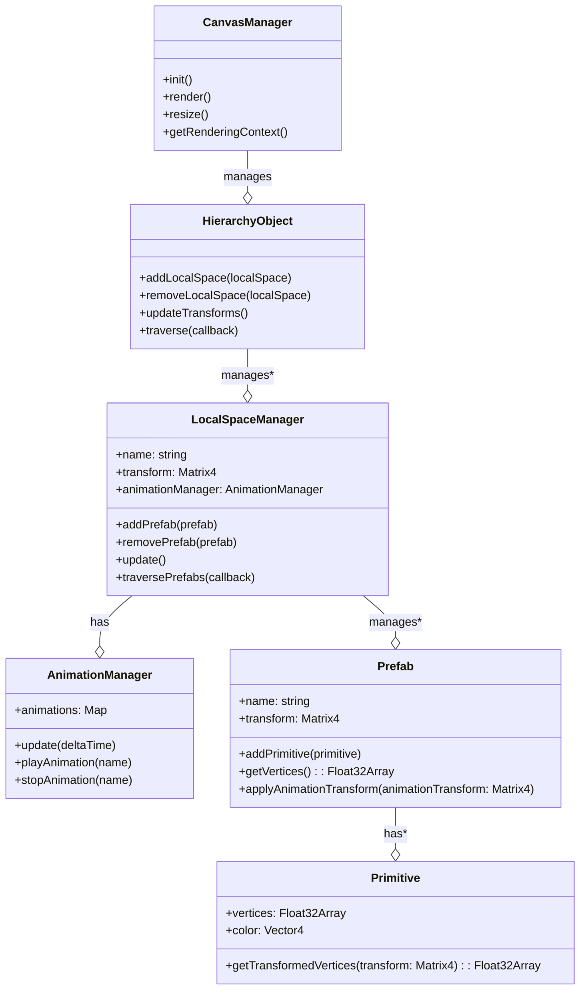
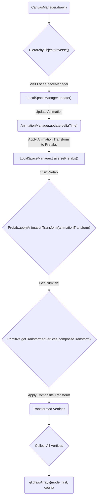

# lowpoly-fishing-simulator

webgl fishing simulator project

## 설계 아이디어

기본적으로 모든 drawtype은 Triangle로

hierarchyManager가 modelViewMatrix를 전파하여 사용

localSpaceManager?
ㅏ 애니메이션
ㅏ 트랜스폼
ㅏ 프리팹들
ㄴ 하위 localSpaceManager

---

## gemini가 짜준거

